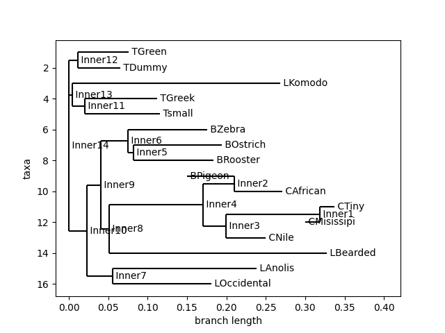

#  Eco-Phylo Insights: Phylogenetic Analysis of Turtles, Lizards, Crocodiles & Birds

Welcome to **Eco-Phylo Insights**, a computational biology project focused on uncovering evolutionary relationships between turtles, lizards, crocodiles and birds through sequence alignment and phylogenetic tree construction.

This repository is part of my personal portfolio and showcases my ability to work with genetic data, implement distance models (like **Jukes-Cantor** and **Kimura**), and visualize evolutionary patterns using Python.

---

## 🚀 Project Highlights

- 🐢 Compares multiple vertebrate species (reptiles and birds)
- 🧬 Implements **Jukes-Cantor** and **Kimura 2-Parameter** models to calculate evolutionary distances
- 🌱 Constructs phylogenetic trees using UPGMA and Neighbor-Joining
- 📊 Includes clear visualizations of distance matrices and resulting trees
- ⚙️ Built entirely in **Python**, in an interactive Jupyter Notebook

---

## Example 

*Tree generated with Clustal Alignment and Kimura distances using the UPGMA method.*

*Tree generated with Clustal Alignment and Jukes-Cantor distances using the Neighbor-Joining method.*
---

## 🧪 Methodology

1. **Data Import & Preprocessing:** FASTA sequences of turtles, lizards, and birds.
2. **Multiple Sequence Alignment:** Using MUSCLE or Biopython tools.
3. **Distance Matrix Generation:**  
   - **Jukes-Cantor model** (assumes equal mutation probability)
   - **Kimura 2-Parameter model** (accounts for transitions and transversions)
4. **Phylogenetic Tree Construction:** Using **UPGMA** and **Neighbor-Joining** algorithms.

---

## 💡 What Sets This Project Apart

- Custom implementation of **both** Jukes-Cantor and Kimura models
- Clear and reusable functions for distance matrix creation
- Insightful visual comparison between models
- Integration with tree-building methods to show practical impact of model choice

## Technologies Used

- Python 3.x
- Jupyter Notebook
- Biopython
- scikit-bio
- matplotlib
- ete3 (for tree rendering)

---

## Contact

**Ana Laura**  
[LinkedIn](https://www.linkedin.com/in/ana-laura-chenoweth-galaz-7a36a7203/)]  
[Email](chenowethgalazanalaura@gmail.com)]

---

## 🏷️ License

MIT License — feel free to use, cite, and build upon this project.

